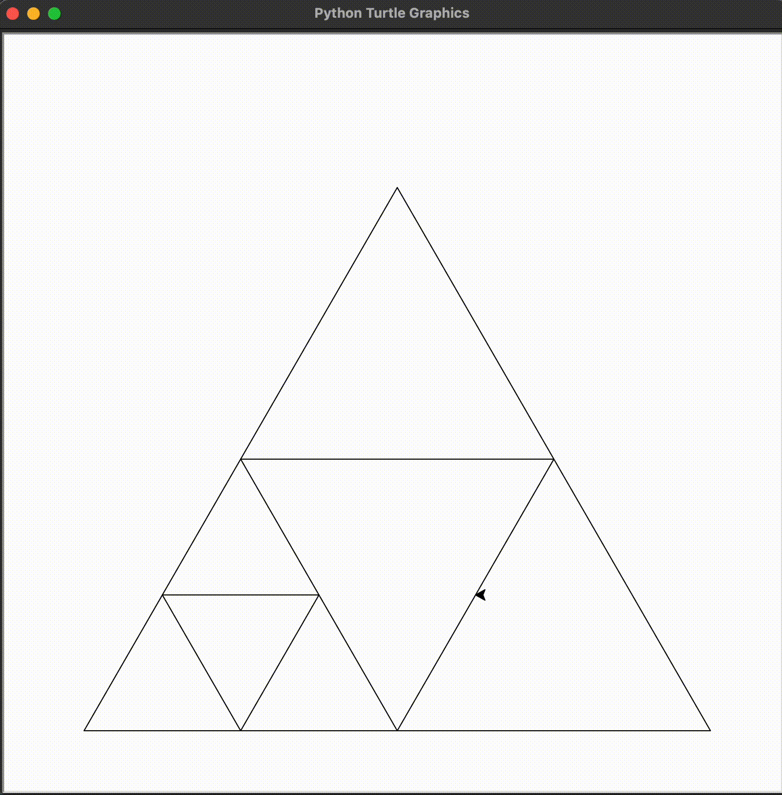

# Sierpinski Triangle

_Note: This is my first touch and project with python_ :satisfied:

_If you have any suggestions for improvement or optimization, let me know_ :blush:

> The Sierpiński triangle (sometimes spelled Sierpinski), also called the Sierpiński gasket or Sierpiński sieve, is a
> fractal attractive fixed set with the overall shape of an equilateral triangle, subdivided recursively into smaller
> equilateral triangles. Originally constructed as a curve, this is one of the basic examples of self-similar sets—that
> is, it is a mathematically generated pattern that is reproducible at any magnification or reduction. It is named after
> the Polish mathematician Wacław Sierpiński, but appeared as a decorative pattern many centuries before the work of
> Sierpiński.
> -- <cite>[Wikipedia](https://en.wikipedia.org/wiki/Sierpi%C5%84ski_triangle)</cite>

## Preview

## What is used

- [turtle](https://docs.python.org/3/library/turtle.html) library
- and my mind :alien:
